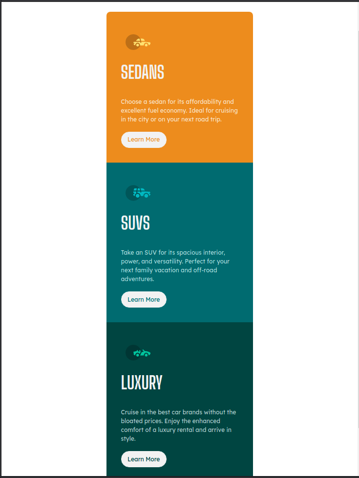
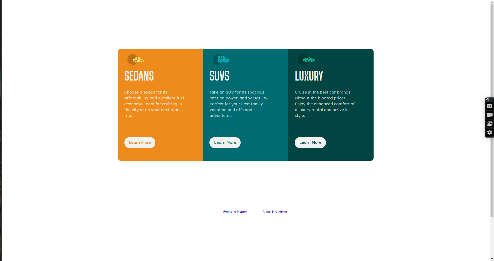

# Frontend Mentor - 3-column preview card component solution

This is a solution to the [3-column preview card component challenge on Frontend Mentor](https://www.frontendmentor.io/challenges/3column-preview-card-component-pH92eAR2-). Frontend Mentor challenges help you improve your coding skills by building realistic projects. 

## Table of contents

- [Overview](#overview)
  - [The challenge](#the-challenge)
  - [Screenshot](#screenshot)
  - [Links](#links)
- [My process](#my-process)
  - [Built with](#built-with)
  - [What I learned](#what-i-learned)
  - [Continued development](#continued-development)
- [Author](#author)

## Overview

### The challenge

Users should be able to:

- View the optimal layout depending on their device's screen size
- See hover states for interactive elements

### Screenshot

- Mobile

- Desktop

### Links

- Solution URL: [Link](https://www.frontendmentor.io/solutions/3-column-card-solution-using-bootstrap-and-pure-css-ZRI3U2V-C)
- Live Site URL: [Link](https://front-end-mentor-projects-sable.vercel.app/3-Column-Card/index.html)

## My process
I used Bootstrap to start with a pre-defined grid system from the get go and the time it took to develop was reduced from almost 2 days for my previous project in pure CSS to almost 3 or 4 hours. This component was made with mobile first approach and scaled to match desktop devices.

### Built with

- Semantic HTML5 markup
- CSS custom properties
- Flexbox
- Mobile-first workflow
- Bootstrap

### What I learned

- Bootstrap libraries potential to reduce development time
- Animation transitions and hover effects

### Continued development

To optimize the css styles I use and next step would be to acheive this with SCSS or Sass preprocessing framework

## Author

- Profile - [Ankur Bhatkalkar](https://www.linkedin.com/in/ankur-bhatkalkar)
- Frontend Mentor - [@ankur26](https://www.frontendmentor.io/profile/ankur26)
