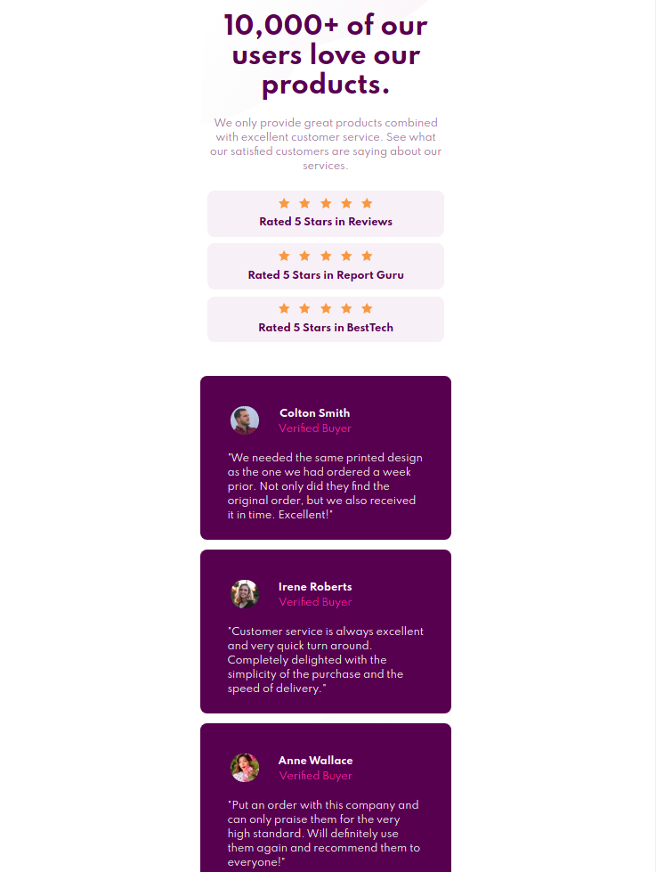
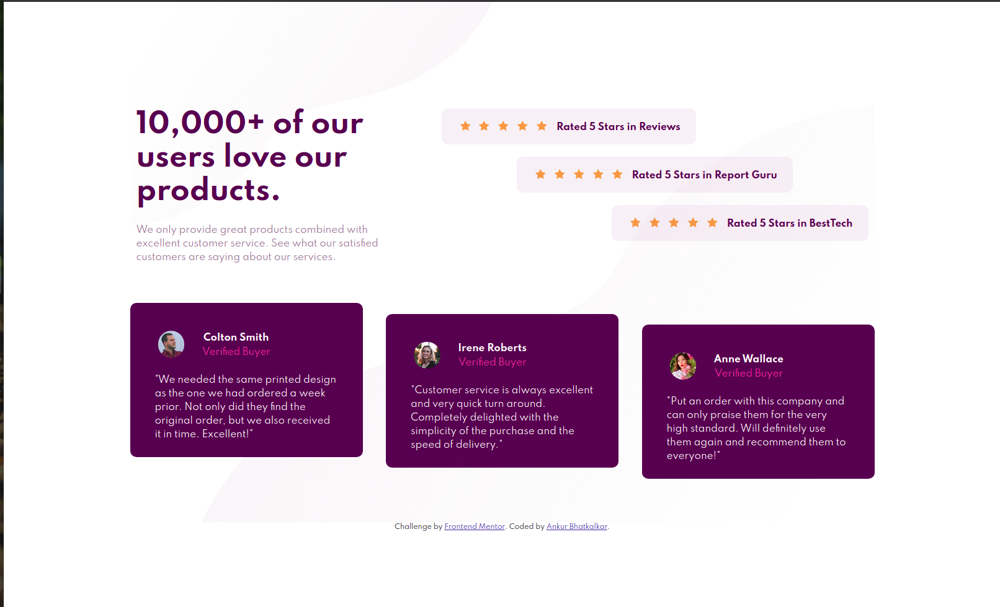

# Frontend Mentor - Social proof section solution

This is a solution to the [Social proof section challenge on Frontend Mentor](https://www.frontendmentor.io/challenges/social-proof-section-6e0qTv_bA). Frontend Mentor challenges help you improve your coding skills by building realistic projects. 

## Table of contents

- [Overview](#overview)
  - [The challenge](#the-challenge)
  - [Screenshot](#screenshot)
  - [Links](#links)
- [My process](#my-process)
  - [Built with](#built-with)
  - [What I learned](#what-i-learned)
  - [Continued development](#continued-development)
  - [Useful resources](#useful-resources)

## Overview

### The challenge

Users should be able to:

- View the optimal layout for the section depending on their device's screen size

### Screenshot

- Mobile

-Desktop

### Links

- Solution URL: [Add solution URL here](https://your-solution-url.com)
- Live Site URL: [Add live site URL here](https://your-live-site-url.com)

## My process

### Built with

- Semantic HTML5 markup
- CSS custom properties
- Flexbox
- Mobile-first workflow

### What I learned

- Learnt on how to use nth of type properties in CSS
- Learnt about object elements, easier way to put in svg without the complications. 
- Learnt about negative margins which help in overlapping elements.
- Learnt on align-self property in flex box to generate the design across the 5 star cards.

### Continued development

- Changing to variable based CSS
- Using a CSS preprocessor
- Improving the design to match visuals a bit better.

## Author

- Profile - [Ankur Bhatkalkar](https://www.linkedin.com/in/ankur-bhatkalkar)
- Frontend Mentor - [@ankur26](https://www.frontendmentor.io/profile/ankur26)

